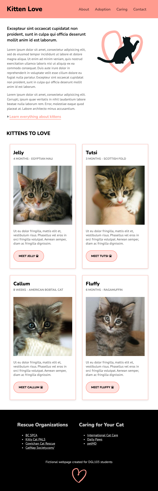

# Week 10 Exercise - Floats and Positioning

## Objectives
You will use the provided HTML and CSS as a starting point, and add a responsive menu to it. You will also change the layout at different breakpoints so that it looks like the provided examples and works on all screen sizes up to 1024px wide. You can only use floats to move content around on the page. You cannot use flexbox for anything.

## Instructions
Remember to make regular commits with descriptive labels.
### 1. Get set up
* Clone your remote exercise repository onto your local machine.
* Add a comment in the head element of the homepage including: the course code and your section number - your name - Week 10 Exercise. Example:
```
<!-- DGL 103 CVS1 - your name - Week 10 Exercise -->
```
### 1. Add a reponsive menu
Start the process by viewing the web page at a small window size to simulate what it might look like on a mobile device: 
  1. With the webpage open in Chrome, right-click > Inspect. 
  2. In the DevTools window, click on the Toggle Device button (in top left-hand corner).
  3. In the browser window, select iPhone SE from the Dimensions drop down menu.
  4. Open a new browser tab and go to https://codepen.io/AskClaireGuiot/pen/rNZdPWq. Use the code in this codepen as inspiration to add a responsive menu to your webpage. The codepen uses flexbox, you must replace flexbox with other layout methods. When you are finished, the header should look like the examples below. The hamburger icon disappears, and the menu list appears permanently on screens wider than 768px. <br>
  #### Responsive menu on mobile:
  
  
  #### Responsive menu on ipad (Select iPad Air from the browser Dimensions drop down menu):
  

### 3. Style the rest of the content for ipad
  3. Add all the HTML and CSS necessary to make the page look like the example below. You can use floats and you can use any display value except for flex and grid. (Tip: You can use the margin's auto value to center content on the screen):<br>
  

### 4. Create another breakpoint for large screens
  1. In the browser window, select Responsive from the Dimensions drop down menu. Type 1024 in the first text field to change the width of the viewport.
  Note: If the computer that you are working on has a small screen and you can't see the whole viewport window then you may need to work on a lab computer.
  2. Add the following media query at the bottom of your CSS:
```
/* Large devices (small laptops, 1024px and up) */
@media only screen and (min-width: 1024px) {

}
```
  3. Add all the HTML and CSS necessary to make the page look like the example below. You can use floats, and any display value except for flex and grid. (Tip: Pay attention to the order of the content in the footer, you may need to duplicate some of the content to make this layout work):<br>
  

### 5. Check the layout in between the breakpoints
  1. In the browser window, select Responsive from the Dimensions drop down menu.
  2. Drag to expand your viewport width. Check that the layout works on all screen sizes, even between the breakpoints. If anything needs to be tweaked, record the viewport width and add a new media query using the width of the viewport as the min-width.
  4. Add any necessary CSS to make the layout work.

### 4. Format, organize and add comments 
* Make sure that your HTML and CSS are well formatted.
* Add organizational CSS comments and order your style rules so that your CSS is easy to read.
* Add a few comments to explain your HTML and CSS code and highlight anything of interest.

### 5. Check for errors
Use the VSCode HTMLHint extension and validate your code to make sure that it is correct (https://validator.w3.org/#validate_by_upload for HTML, https://jigsaw.w3.org/css-validator/ for CSS).

### 6. Submit your work
1. Commit your changes.
2. Push your changes to GitHub. 
3. Submit in Brightspace to the "Unit 3 Exercises" assignment and follow the instructions. 
4. If you have been using a lab computer on campus, remember to restart the computer.

## Deadlines
Assignments must be submitted before the end of the week but they will only be graded at the end of every unit. Late assignments will not be accepted and will receive an F. You can complete and submit a contract that allows you to extend the deadline for an assignment but you must email it to your instructor a minimum of 48 hrs before the deadline. Deadline extensions are only allowed for those unplanned, unexpected emergencies that life sometimes throws at us, and they will only be approved by your instructor if you follow the correct process. See the Course Info folder in BrightSpace for more info.